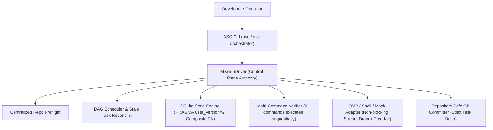

# ASC Orchestrator v2.3.0 — Final Real-Project Reliability Audit

**Document Status:** AUTHORITATIVE AUDIT  
**Target Repository:** `D:\Usama Data\All Software\ASC-Orchestrator-v2`  
**Git Baseline SHA:** `10def216a368af8e07a10be5d6a8292abab7852b`  
**Dedicated Branch:** `feature/asc-orchestrator-final-reliability`  
**Prime Upstream Reference:** `PRIME_UPSTREAM_IDENTITY = NOT VERIFIED` (Verified that `ASC DevOS` is an unversioned experimental workspace, not a Git repository)

---

## 1. Executive Summary & Findings Matrix

| Finding / Area | Section | Source Location | Classification | Rationale & Remediation Plan |
| :--- | :---: | :--- | :---: | :--- |
| **Product Identity / Naming** | §7 | `cli.py`, `console.py`, `models.py`, `pyproject.toml` | **NEEDS FIX** | Naming currently displays "ASC DevOS". Fix to "ASC Orchestrator" while keeping `asc` and `asc-orchestrator` CLI entry points. |
| **Path Precedence & State Location** | §8 | `state.py`, `driver.py`, `cli.py` | **NEEDS FIX** | Conflation of invocation dir, mission file, target repo, and state root. Define strict precedence contract: Task `working_directory` > CLI `--cwd` > Mission `working_directory` > Mission `defaults.working_directory` > `invocation_dir`. State lives at target repo root. |
| **CLI Overrides Default Overwrite** | §9 | `cli.py` | **NEEDS FIX** | `--execution-timeout` (600) and `--verification-timeout` (300) default to non-None values, overriding mission YAML settings. Set optional CLI defaults to `None`. |
| **Universal SQLite Task Identity** | §10 | `state.py` | **NEEDS FIX** | `tasks` table PK is `id TEXT PRIMARY KEY`, causing collision when multiple missions use "T1". Migrate schema to composite `(mission_id, id)` or mission-scoped identity with `PRAGMA user_version` migrations. |
| **Duplicate Mission-ID Safety** | §11 | `state.py`, `driver.py` | **NEEDS FIX** | Prevent silent overwrites of durable mission history. Enforce resume or explicit new-run semantics. |
| **Execution Contract Persistence** | §12 | `state.py`, `models.py` | **NEEDS FIX** | Persist full execution contract (model, executor, timeouts, verification commands, commit paths, working_directory) in SQLite. |
| **Interruption & Stale State Reconciliation** | §13 | `driver.py`, `dag.py`, `state.py` | **NEEDS FIX** | If process crashes while a task is `RUNNING`, mark attempt as `INTERRUPTED`, restore task to runnable if attempts remain, preserving attempt budget and stdout/stderr evidence. |
| **Centralized Repository Preflight** | §14 | `driver.py` | **NEEDS FIX** | Centralize dirty repo check in `MissionDriver.run()` so programmatic invocations, REPL, and resume cannot bypass preflight safety. |
| **Task-Owned Git Delta Staging** | §15 | `driver.py`, `repo.py` | **NEEDS FIX** | Pass exact task-created delta to `commit_scoped`. If unrelated dirty files appear, do not stage them; block/warn on ambiguous ownership. |
| **Failed Attempt Rollback Safety** | §16 | `repo.py` | **NEEDS FIX** | Remove aggressive `shutil.rmtree` on untracked directories. Only rollback verified attempt-created files. |
| **OMP Process Streaming & Deadlock Fix** | §17 | `adapters/omp.py` | **NEEDS FIX** | Replace blocking polling loop with concurrent thread-drained stdout/stderr streams to prevent OS pipe buffer deadlocks on large outputs (>64KB). |
| **Process Tree Termination on Timeout** | §18 | `adapters/omp.py` | **NEEDS FIX** | Ensure process trees (including child shells/tools) are terminated cleanly on timeout (e.g. `taskkill /T /F /PID` on Windows). |
| **Multi-Command Verification Execution** | §19 | `verifier.py` | **NEEDS FIX** | `verifier.py` currently executes only `commands[0]`. Update to execute all commands in sequence, stopping on first failure, tracking individual exit codes and durations. |
| **Structured Executor Result Contract** | §20 | `models.py`, `adapters/` | **NEEDS FIX** | Standardize structured result with duration, exit code, timeout flag, summaries, and observed delta. |
| **Machine-Readable CLI Output (`--json`)** | §21 | `cli.py`, `console.py` | **NEEDS FIX** | Add `--json` flag to `asc doctor`, `asc status`, `asc logs`, `asc run`, and `asc resume`. |
| **System-Impact Safety Boundary** | §22 | `spec.py`, `models.py` | **NEEDS FIX** | Set default `system_changes = DENIED`. Reject missions attempting machine-wide infrastructure alterations. |
| **Capability / Precondition Model** | §23 | `spec.py`, `models.py`, `driver.py` | **NEEDS FIX** | Express preconditions as capabilities (e.g. reachable port/service) rather than requiring specific installation mechanisms. |
| **Legacy vs Universal State Authority** | §24 | `src/asc/`, `src/asc_orchestrator/` | **NEEDS FIX** | Explicitly document and isolate state engines: Universal `asc` uses SQLite; legacy `asc-orchestrator` uses PESE. |
| **Operator Telemetry Truthfulness** | §25 | `console.py` | **NEEDS FIX** | Eliminate misleading placeholder values (`1/1`, fabricated routes) when missions are idle or unprobed. |
| **Event Ledger Recency Ordering** | §26 | `state.py` | **NEEDS FIX** | Fix SQL query so `LIMIT` returns the newest N events in chronological order. |
| **Project Memory Reconciliation** | §27 | `docs/project-memory/*.md` | **NEEDS FIX** | Reconcile all project memory docs with v2.3.0 and baseline SHA `10def21`. |

---

## 2. Architectural Boundary Contract

