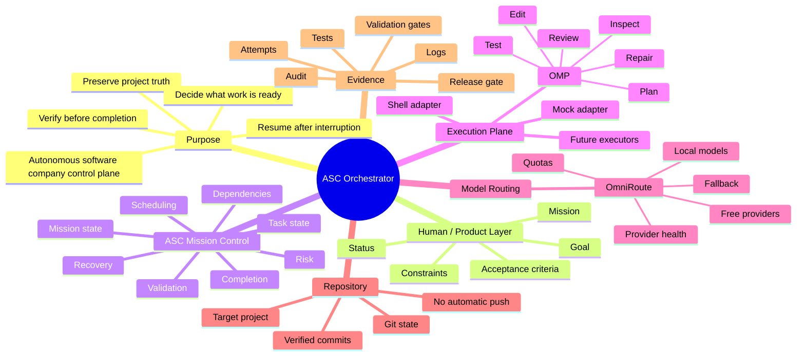
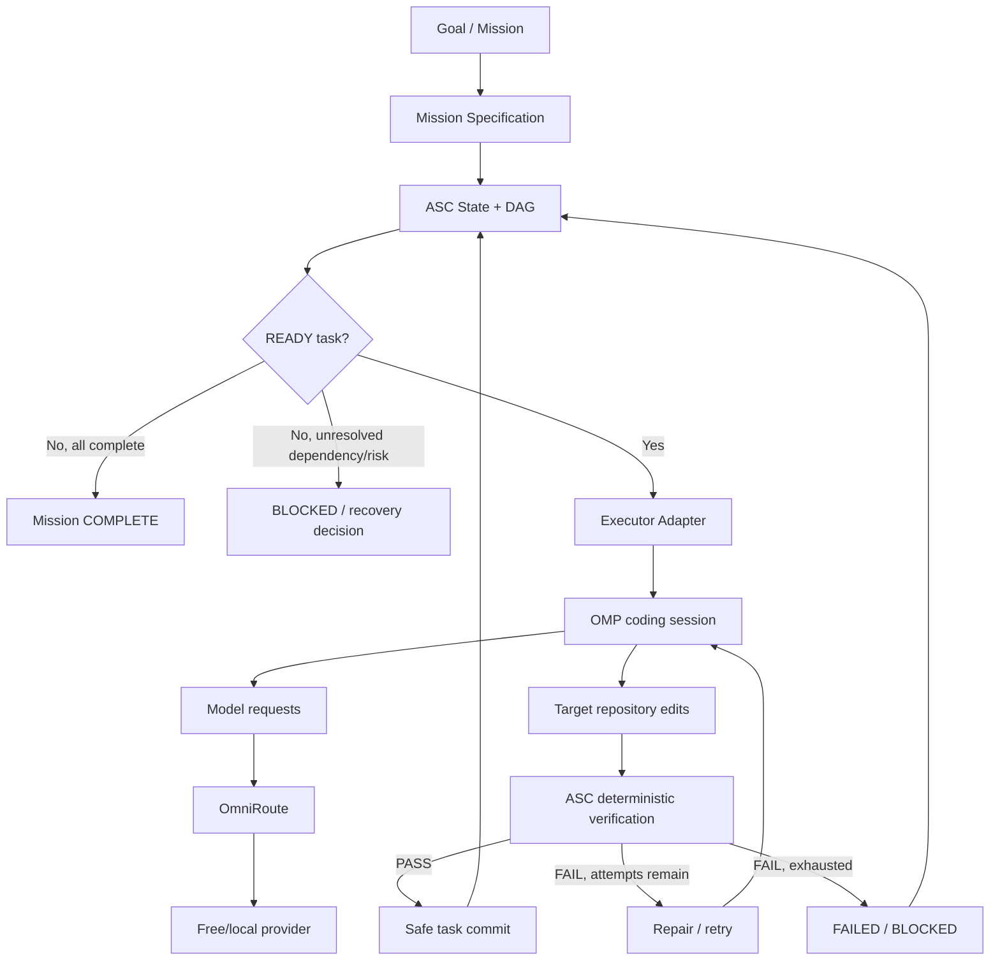
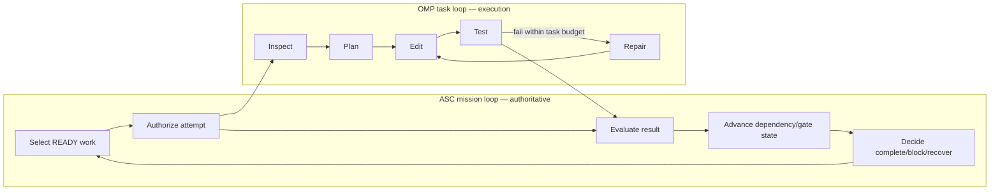
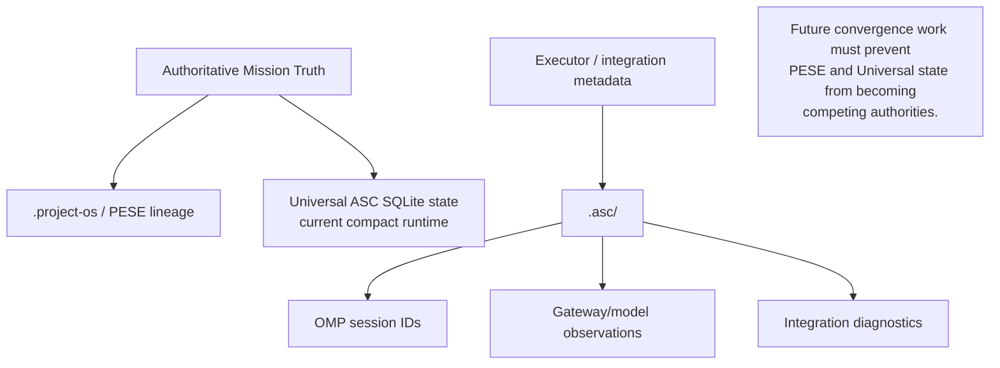

# ASC Orchestrator — Master Mind Map

**Purpose:** One-page conceptual map of what ASC is, what exists, what is frozen, what is current, and what comes next.

---

# 1. Core idea



---

# 2. Current repository generations

```mermaid
flowchart TD
    R[ASC-Orchestrator-v2 Repository]

    R --> L[Legacy / Rich Control Plane<br/>src/asc_orchestrator]
    R --> U[Universal ASC v2 Core<br/>src/asc]

    L --> ACP[ACP Communication]
    L --> ACR[ACR Capability Registry]
    L --> PESE[PESE Persistent State]
    L --> TBE[TBE Team Builder]
    L --> MSS[MSS Mission Standard]
    L --> EEF[EEF Lifecycle]
    L --> CKS[CKS Keys/Signing]
    L --> AEX[AEX Assignment Lifecycle]
    L --> AHP[AHP Health]
    L --> VAL[VAL Validation]
    L --> RKM[RKM Risk]
    L --> AGC[AGC Agent Lifecycle]
    L --> REC[REC Recovery]
    L --> ETR[ETR Encrypted Transport]
    L --> AWS[AWS Scheduler]
    L --> REL[REL Release]

    U --> MODELS[models]
    U --> SPEC[spec]
    U --> DAG[dag]
    U --> STATE[state / SQLite]
    U --> DRIVER[driver]
    U --> VER[verifier]
    U --> REPO[repo / Git]
    U --> ADAPT[adapters]
    U --> CLI[asc CLI]
    U --> REL2[v2 release verifier]

    ADAPT --> MOCK[Mock]
    ADAPT --> SHELL[Shell]
    ADAPT -. planned .-> OMP[OMP Adapter]
```



---

# 3. Intended final runtime flow



---

# 4. Two autonomy loops



**Never add a third independent mission-state loop.**

---

# 5. State ownership



---

# 6. Historical evolution

```text
Foundation
   ↓
ACP / ACR
   ↓
PESE persistent truth
   ↓
TBE team assembly
   ↓
MSS mission intake
   ↓
EEF lifecycle
   ↓
CKS signing
   ↓
AEX assignment lifecycle
   ↓
AHP health
   ↓
VAL validation
   ↓
RKM risk
   ↓
AGC agent lifecycle
   ↓
REC recovery
   ↓
ETR encrypted transport
   ↓
AWS scheduler
   ↓
REL release verifier
   ↓
v1.0.1 repository reconciliation
   ↓
v1.0.2 dependency/lifecycle fixes
   ↓
v1.0.3 historical-state compatibility
   ↓
Universal ASC v2 compact core
   ↓
PR #6 merged + CI/Release Gate green
   ↓
NEXT: real OMP executor bridge
```

---

# 7. What is complete vs incomplete

## Complete / merged

```text
[✓] Rich legacy control-plane contracts
[✓] Persistent/audited state
[✓] Dependency/lifecycle foundations
[✓] Risk/recovery/validation foundations
[✓] Universal task/DAG core
[✓] SQLite mission/task/attempt/event state
[✓] Universal CLI
[✓] Mock/Shell adapter foundation
[✓] Git helper foundation
[✓] Release verifier
[✓] CI across Python 3.11 / 3.12 / 3.13
[✓] PR #6 merged
```

## Not complete

```text
[ ] Real OMP adapter
[ ] Execute → verify pipeline
[ ] Full bounded retry integration
[ ] Safe target-repository dirty-state isolation
[ ] Explicit executor selection
[ ] Multi-command verification contract
[ ] Sandbox OMP E2E
[ ] Real project pilot
[ ] Final convergence of old rich control plane and Universal core
```

---

# 8. The mental model to remember

If only one picture survives ten years from now, remember this:

```text
                 ┌────────────────────────┐
                 │          ASC           │
                 │ brain / mission truth  │
                 └───────────┬────────────┘
                             │ assignment
                             ▼
                 ┌────────────────────────┐
                 │          OMP           │
                 │ hands / coding runtime │
                 └───────────┬────────────┘
                             │ model calls
                             ▼
                 ┌────────────────────────┐
                 │       OmniRoute        │
                 │ model/network routing  │
                 └───────────┬────────────┘
                             │
                             ▼
                      AI providers/models

ASC decides WHAT and whether it is accepted.
OMP decides HOW to perform the coding task.
OmniRoute decides WHICH model/provider handles inference.
```
